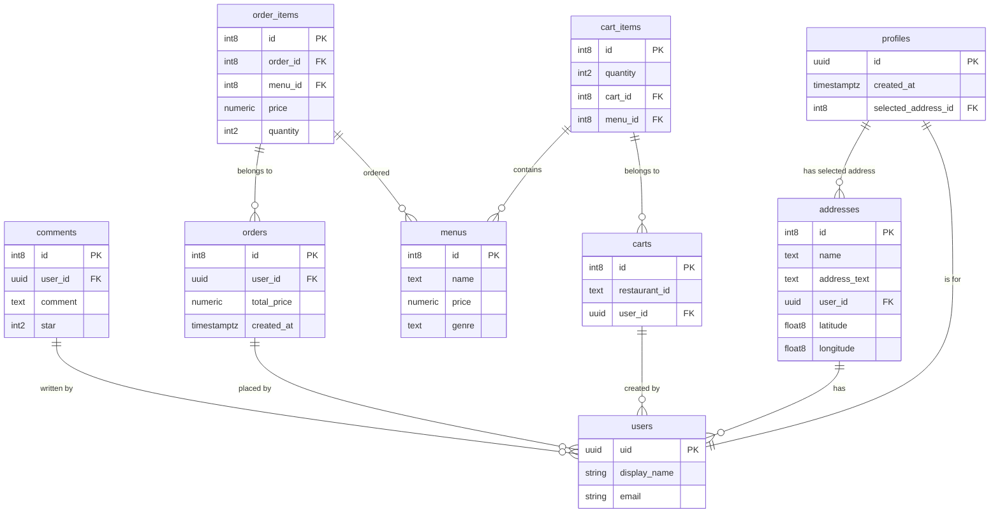

# Tber-Delivery

## 🚀 概要

Tber-Deliveryは、近隣のラーメン・レストラン情報を検索・閲覧・注文できるフルスタックWebアプリです。
ユーザーは地図や住所、店舗名、カテゴリでレストランを検索し、カート・決済・履歴確認・コメント・評価まで可能です。

---


## 🔗 Demo
https://tber-delivery.vercel.app/

- トップページ

<br><br>


- 店舗詳細ページ

<br><br>


- カテゴリ検索結果ページ

<br><br>


- 注文確認ページ

<br><br>


- 決済ページ

<br><br>


### 📊 データベース設計 (ER図)




---

## 🛠 技術スタック

### フロントエンド
- フロントエンド: Next.js, TypeScript, TailWindCSS　SWR (データフェッチ・キャッシュ管理)
- バックエンド: Supabase (認証、DB)
- 決済: Stripe Checkout + サービス手数料反映
- API: Google Places API　Maps JavaScript API
- その他:レスポンシブデザイン対応

---

## ✨　主な機能

### フロントエンド
- トップページ: 近隣店舗カルーセル、カテゴリ検索、キーワード予測
- レストラン詳細: コメント・評価機能
- 注文フロー: カート管理、履歴確認
- ユーザー認証: メール・パスワード + OAuth

### バックエンド/API
- Supabase認証 & DB管理
- Stripe決済 + 注文データ確定
- Google Places APIによる店舗情報取得
- エラーハンドリング、レスポンス最適化

### その他
- pnpm（パッケージ管理）
- Vercel（デプロイ）

---


## 🧰 セットアップ方法

### 前提条件
- Node.js 18 以上
- pnpm

### インストール・起動
   ```bash
   pnpm install
   pnpm run dev
   ```
   → `http://localhost:3000` で起動します。
   ※ 初回は `pnpm install` で依存関係インストールが必要です。

### env.localに環境変数をセット
- プロジェクト直下に .env.local を作成
- 以下を設定してください
 ```bash
NEXT_PUBLIC_SUPABASE_URL=
NEXT_PUBLIC_SUPABASE_PUBLISHABLE_KEY=
NEXT_PUBLIC_SITE_URL=http://localhost:3000
NEXT_PUBLIC_API_URL=http://localhost:3000/api
GOOGLE_API_KEY=
STRIPE_SECRET_KEY=
  ```


---

## 🧠 工夫した点

### ⚡️Stripe Checkout を活用したセキュアな決済フローを構築
- 動的なラインアイテム生成: カート内の商品データに基づき、バックエンド（Route Handlers）でリアルタイムに決済セッションを生成。
  
- 手数料などの追加項目も柔軟に統合。
  
- 決済完了後の自動処理: Stripe の session_id を検証キーとして、決済完了ページで注文ステータスの更新とカートのクリアを自動実行。
### ⚡️Supabase 認証状態に応じたアクセス制御
### ⚡️ Server Component / Client Component の適切な使い分け
### ⚡️ Route Handlers / Server Actions の適切な使用
### ⚡️ コンポーネント分割と責務の明確化
### ⚡️ TypeScript による適切な型定義と型エラー回避
- Supabase CLI による型生成: DBスキーマから自動で TypeScript 型定義を生成し、フロントエンドからバックエンドまで一貫した型安全性を確保。
### ⚡️ Supabase API 通信時のエラーハンドリング
- APIリクエスト失敗時（response.ok 以外）は、詳細なエラーログ（JSONデータ）をサーバー側のコンソールに出力してデバッグを容易にしつつ、呼び出し元にはステータスコードを含む最小限のエラーメッセージを返すことで、フロントエンドの安全なエラーハンドリングを実現しています。
  
- ユーザーの認証エラーや住所未設定時には即座に**デフォルトの座標（東京中心部）**を返すように実装。ユーザーが立ち往生することなく、すぐにアプリの主要機能（店舗閲覧）を体験できるUXを実現しています。
  
- APIから取得したデータが空（data.places が存在しない）場合でも、空配列 [] を返すように実装。フロントエンド側での map 処理等によるエラーを防いでいます。
### ⚡️ SWRによるデータフェッチとキャッシュ最適化
 データの取得と状態管理には **SWR** を採用し、パフォーマンスとUXの両立を図っています。
- キャッシュ共有:** 共通の `fetcher` とキャッシュキーを利用することで、異なるページやコンポーネント間でも一度取得したデータを再利用し、ネットワーク負荷を軽減しています。
  
- データの一貫性:** 注文確定やプロフィール更新などの操作後、特定のキーに対して再検証（revalidate）を実行。これにより、リロードなしでアプリ全体の表示を最新状態に同期させています。

---


## 今後の改善

- フロント・バックのパフォーマンス最適化
